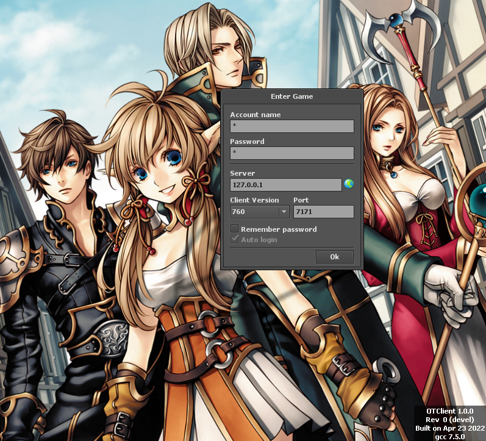

# Tibia server login

A rust server that handles Tibia 7.6 protocol login. Tested on OTclient commit 45afb65b90284ce70f328733715043860186bf50

Uses a fake account with credentials:

- Account number: `1`
- Password: `1`

Based on https://mateuszholowieszko.com/developing-tibia-server-from-scratch-with-nodejs/

## Screenshots

The client is a black screen because the only thing implemented was the login server, not the game protocol itself.
